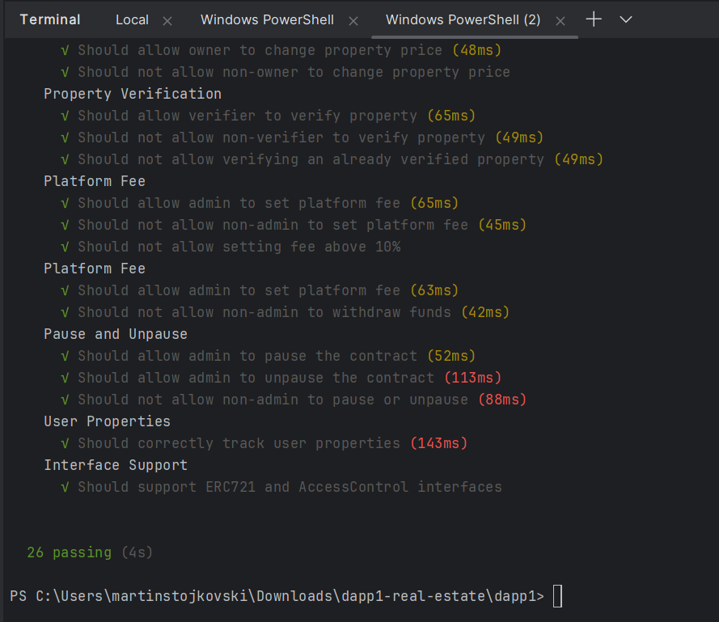

# Real Estate NFT Marketplace

## Project Overview

This is a decentralized Real Estate NFT Marketplace built using Solidity, Hardhat, and Ethereum blockchain technology.
The project enables users to create, list, verify, and trade real estate properties as NFTs with advanced features like
role-based access control and platform fees.

## 🚀 Features

- **NFT Property Creation**: Mint unique real estate properties as NFTs
- **Property Verification**: Roles-based property verification system
- **Sales Mechanism**: List and sell properties with platform fee integration
- **Access Control**: Implemented using OpenZeppelin's AccessControl
- **Security**: Includes pausable and reentrancy guard mechanisms

## 📋 Prerequisites

- Node.js (v16 or higher)
- npm
- Hardhat ***(required for local deployment)***
- MetaMask or similar Ethereum wallet (optional)
- Intellij/PowerShell/CommandPrompt

## 🔧 Installation

1. Clone the repository:

```bash
git clone https://gitlab.inf.unibe.ch/crypto-public/sem-crypto-hs24-arb.git
```

2. Change directory to:

```bash 
cd dapp1
```

3. Install dependencies:

```bash
npm install
```

## 🔬 Setup and Contract Deployment

### Local Deployment

# 1. In PowerShell or CommandPrompt in Intellij terminal start the local Hardhat node: #

```bash
npx hardhat node
```

### This is how should look like the initial start of the node with 20 test accounts in total. ###


### Execute this script in another terminal/window, so you could successfully make the initial setup, `first terminal stays open`. ###

```bash
npx hardhat run scripts/setup.js --network localhost 
```


# 2. After this stage, you have to set up the deploy.js script to deploy the contract on the local Hardhat node. #

### From the accounts in terminal. Set up the Account #0 `OWNER_PRIVATE_KEY`, Account #1 `BUYER_PRIVATE_KEY_1`, Account #2 `BUYER_PRIVATE_KEY_2` ###

```bash
npx hardhat run scripts/deploy.js --network localhost 
```

### This is the outcome.


# 3. After deployment, open `scripts/createProperties.js`. #

### You have to copy and paste the `CONTRACT_ADDRESS` and `OWNER_PRIVATE_KEY` in the placeholder in createProperties.js script. ###

```bash
npx hardhat run scripts/createProperties.js --network localhost 
```

### This should be the outcome of the executed script, with created 3 properties with its details and the outcome of three created properties look at the second picture. ###


# 4. After creating the properties open the scripts/simulateTransactions.js script. #

### Set up the `CONTRACT_ADDRESS`, `BUYER_PRIVATE_KEY_1`, `BUYER_PRIVATE_KEY_2` strings you have to replace those as well as execute this command. ###

```bash
npx hardhat run scripts/simulateTransactions.js --network localhost 
```

### This is how the outcome should look, in the end.


### After this stage, you have successfully deployed the contract on the local Hardhat node and created the properties and simulated the transactions. ###

### You can check the properties and transactions in the terminal where the Hardhat node is running. ###

# 5. Testing part
```bash
npx hardhat test
```

### This is how the outcome should look like, with all the tests passed. ###



